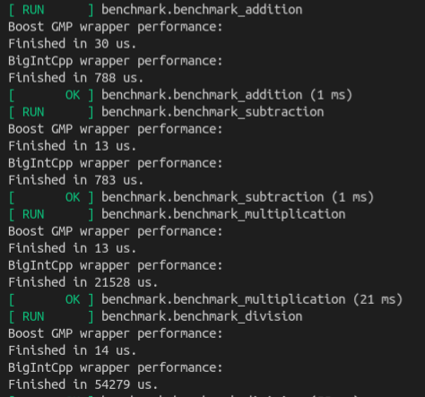

# BigIntCpp
Arbitrarily large precision BigInt Cpp Implementation.

## Description
BigIntCpp is a header only library containing signed (bigint.h) and unsigned (ubigint.h) big-integer implementations. It utilizes std::deque as the underlying storage mechanism.

To run unit tests, simply build and run from BigIntCpp which automatically runs all gtests in BigIntCpp/tests. Benchmark tests require boost, gmp installation.

This implementation is a starting point (not meant to be optimized) BigInt Cpp implementation with the purpose of demonstrating big-integer specific algorithms in modern cpp. It won't come close to touching the performance of a library such as [GMP](https://gmplib.org/).

Possible future optimizations for BigIntCpp:

- FFT based multplication in certain cases
- Divide and conquer division optimization
- Base power of 2 (currently using base-10)
- Optimizing implementation of underlying container (currently std::deque simply for easy/fast implementation)
  - Most notibly minimizing inserts/shifts
  - Possibly changing container type

As mentioned, lots of optimization opportunities for division/multiplication:

